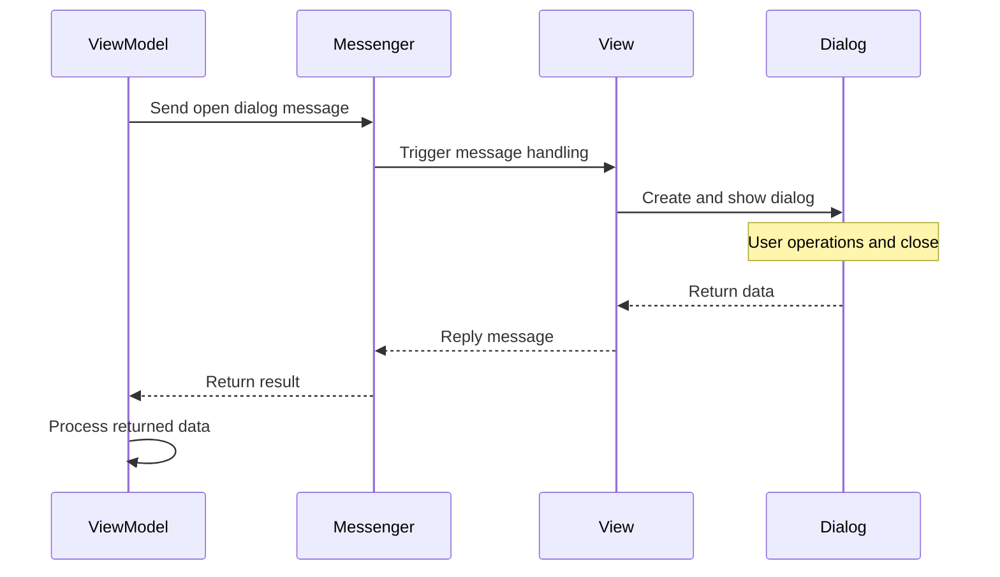

This note primarily records how to obtain custom dialog data through the messaging mechanism in MVVM mode.

This requirement arose when implementing a small CRUD page, where the original add functionality was separated into a dialog to streamline the main interface.

Runtime environment:

- .NET 10
- CommunityToolkit.Mvvm 8.4.0

## Implementation Steps

First, define a message class with reply functionality to serve as a medium for passing data between different Views and ViewModels. Then subscribe and send messages separately in View and ViewModel.

The purpose of this message class is to notify the receiver to open the dialog and return data after the dialog closes.



{}

### Step 1: Define a Message Class with Reply Capability

Define a regular class that inherits from CommunityToolkit.Mvvm's `RequestMessage`, enabling the `Send` method to have a return value. This return value is the data replied by the message subscriber.

```csharp
public class OpenDialogMessage : RequestMessage<string> { }
```

At this point, the message receiver can also use the `Reply` method on the message to reply to the message sender.

> For more message types, you can refer to [this website](https://mvvm.coldwind.top/Messengers/Messages/).

### Step 2: Main Window ViewModel Sends "Open Dialog" Message

Create a command bound to the corresponding button or other trigger. When triggered, it sends the "open dialog" message, receives the subscriber's reply, and prints it to the console.

```csharp  {filename="MainWindowViewModel.cs"}
public partial class MainWindowViewModel : ObservableObject
{
    [RelayCommand]
    private void OpenDialog()
    {
        var result = WeakReferenceMessenger
            .Default.Send<OpenDialogMessage>();
        
        if (result != null)
        {
            Console.Out.WriteLine("result = {0}", result.Response);
        }
    }
}
```

### Step 3: Main Window Code-Behind Subscribes to Message

```csharp {filename="MainWindow.xaml.cs"}
public partial class MainWindow : Window
{
    public MainWindow()
    {
        InitializeComponent();

        DataContext = new MainWindowViewModel();
        
        WeakReferenceMessenger.Default
            .Register<MainWindow, OpenDialogMessage>(this, (receiver, message) => { });
    }
}
```

### Step 4: Add Close Event to Dialog and Display Dialog

Create an anonymous function for message handling, called when the message is received. Within it, create the dialog and add a window close event. When the window closes, reply the dialog data to the sender.

```csharp {hl_lines=[10,13,15,16,20],filename="MainWindow.xaml.cs"}
public partial class MainWindow : Window
{
    public MainWindow()
    {
        // --- Omit existing code ---
        
        WeakReferenceMessenger.Default
            .Register<MainWindow, OpenDialogMessage>(this, (receiver, message) =>
        {
            var dialog = new DialogWindow();
            
            // Add a window close event
            dialog.Closed += (s, e) =>
            {
                var w = s as DialogWindow;
                message.Reply(w?.InputText.Text);
            };
			
            // Opens the Modality dialog box
            dialog.ShowDialog();
        });
    }
}
```

### Step 5: Create Dialog Interface

In this interface, there are three key points to note:

- The TextBox input content is the data to be retrieved, so it has been given a `Name` attribute for subsequent access.
- The two `Button` controls have `IsDefault` and `IsCancel` properties set respectively:
  - `IsDefault`: Sets whether the [Button](https://learn.microsoft.com/en-us/dotnet/api/system.windows.controls.button?view=windowsdesktop-10.0) is the **default** button. Users invoke the default button by pressing `Enter`.
  - `IsCancel`: Sets whether the [Button](https://learn.microsoft.com/en-us/dotnet/api/system.windows.controls.button?view=windowsdesktop-10.0) is the **cancel** button. Users can invoke the cancel button by pressing `ESC`.
- Click events are created for both `Button` controls to set the `DialogResult` value.

> Since a modal dialog is opened here, as long as the dialog result value (`DialogResult`) is set, the window will automatically close.




```xml {hl_lines=[14,20]}
<Window --- Omit existing code ---
        MinHeight="200" MinWidth="300"
        SizeToContent="WidthAndHeight"
        ResizeMode="NoResize"
        WindowStartupLocation="CenterOwner">
    
    <Grid RowDefinitions="Auto, *" 
          ColumnDefinitions="Auto, *" 
          Margin="20">
        <TextBlock Grid.Row="0" Grid.Column="0" 
                   Margin="0 0 5 0"
                   Text="Text:"/>
        <TextBox Grid.Row="0" Grid.Column="1" 
                 Name="InputText" Height="100"/>

        <StackPanel Grid.Row="2" Grid.Column="1" 
                    Orientation="Horizontal" HorizontalAlignment="Right"
                    VerticalAlignment="Bottom">
            <Button Name="OkBtn" Margin="0 0 5 0" 
                    IsDefault="True" Click="OkBtn_OnClick"
                    Content="OK"/>
            <Button Name="CancelBtn" IsCancel="True">Cancel</Button>
        </StackPanel>
    </Grid>
</Window>
```

- `MinHeight`: Sets the minimum height of the dialog.
- `MinWidth`: Sets the minimum width of the dialog.
- `SizeToContent`: Sets the dialog size to automatically adjust window height and width based on content.
- `ResizeMode`: Sets the dialog's resize mode, here set to non-resizable.
- `WindowStartupLocation`: Sets the dialog's startup position, here set to center display.



```csharp
private void OkBtn_OnClick(object sender, RoutedEventArgs e) =>
    DialogResult = true;

private void CancelBtn_OnClick(object sender, RoutedEventArgs e) =>
    DialogResult = false;
```




{}

## Summary

The greatest challenge here is how to conveniently and quickly pass data between different Views and ViewModels, rather than relying on integrating corresponding instances or using dependency injection, which would indirectly increase coupling.

With the messaging mechanism, this problem is solved. The messaging mechanism is an implementation of the Mediator pattern, similar to events. When we subscribe to events, we can pass some custom operations, and then wait for the event to be triggered.

Another issue is that WPF, unlike Avalonia, can only return a bool type for dialog return values. To retrieve data, some effort is required to manually get the dialog's property values.

## References

- [Dialog Box Overview - WPF | Microsoft Learn](https://learn.microsoft.com/en-us/dotnet/desktop/wpf/windows/dialog-boxes-overview)
- [Messengers | CommunityToolkit - From Beginner to Expert](https://mvvm.coldwind.top/Messengers/)
- [MusicStore | Avalonia Samples](https://github.com/AvaloniaUI/Avalonia.Samples/tree/main/src/Avalonia.Samples/CompleteApps/Avalonia.MusicStore)
