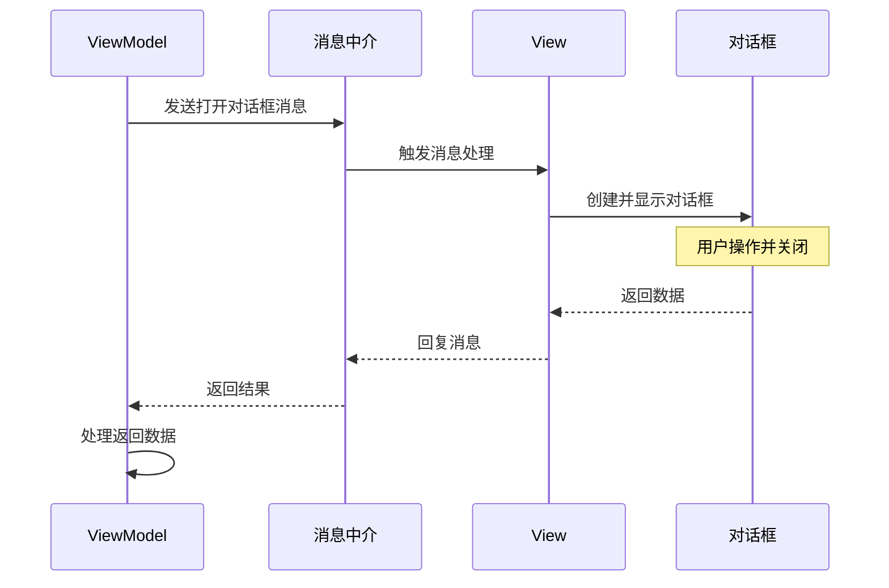

本篇笔记主要记录如何在 MVVM 模式下，通过消息机制获取自定义对话框的数据。

这是在实现一个增删查改的小页面时出现的需求，将原本添加的功能单独放在对话框中，进而精简主界面。

运行环境：

- .NET 10
- CommunityToolkit.Mvvm 8.4.0

## 实现步骤

先定义一个带回复功能的消息类，用作媒介，传递不同的 View 和 ViewModel 之间的数据，然后分别在 View、ViewModel 中订阅、发送消息。

这个消息类的作用是通知接收者该打开对话框，并在对话框关闭后将数据返回。



{}

### 步骤 1：定义带回复能力的消息类

定义一个普通的类，继承 CommunityToolkit.mvvm 的 `RequestMessage`，使 `Send` 方法拥有一个返回值，而这个返回值就是消息订阅者回复的数据。

```csharp
public class OpenDialogMessage : RequestMessage<string> { }
```

此时，消息的接收者也能够通过消息上的 `Reply` 方法回复消息的发送者。

> 如果需要了解更多的消息类型，可以到 [此网站](https://mvvm.coldwind.top/Messengers/Messages/) 查阅。

### 步骤 2：主界面 ViewModel 发送 "打开对话框" 消息

创建一个命令，绑定到对应的按钮或其他触发器上，当触发后，会发送"打开对话框"的消息，并接收订阅者的回复，然后打印在控制台中。
```csharp {filename="MainWindowViewModel.cs"}
public partial class MainWindowViewModel : ObservableObject
{
    [RelayCommand]
    private void OpenDialog()
    {
        var result = WeakReferenceMessenger
            .Default.Send<OpenDialogMessage>();
        
        if (result != null)
        {
            Console.Out.WriteLine("result = {0}", result.Response);
        }
    }
}
```

### 步骤 3：主界面后置代码订阅消息

```csharp {filename="MainWindow.xaml.cs"}
public partial class MainWindow : Window
{
    public MainWindow()
    {
        InitializeComponent();

        DataContext = new MainWindowViewModel();
        
        WeakReferenceMessenger.Default
            .Register<MainWindow, OpenDialogMessage>(this, (receiver, message) => { });
    }
}
```

### 步骤 4：为对话框添加关闭事件，并显示对话框

创建消息处理的匿名函数，当接收到消息后调用。在其中创建对话框，并添加窗口关闭事件，等到窗口关闭时，就将对话框的数据回复给发送者。

```csharp {hl_lines=[10,13,15,16,20],filename="MainWindow.xaml.cs"}
public partial class MainWindow : Window
{
    public MainWindow()
    {
        // --- 省略已有代码 ---
        
        WeakReferenceMessenger.Default
            .Register<MainWindow, OpenDialogMessage>(this, (receiver, message) =>
        {
            var dialog = new DialogWindow();
            
            // 添加窗口关闭事件
            dialog.Closed += (s, e) =>
            {
                var w = s as DialogWindow;
                message.Reply(w?.InputText.Text);
            };
			
            // 打开模态对话框
            dialog.ShowDialog();
        });
    }
}
```

### 步骤 5：创建对话框界面

在这个界面中，需要注意的有三点：

- TextBox 的输入内容，是要获取的数据，所以为其添加了一个 `Name` 属性，方便后续调用。
- 两个 `Button` 分别设置了 `IsDefault` 和 `IsCancel` 属性：
    - `IsDefault`： 设置 [Button](https://learn.microsoft.com/zh-cn/dotnet/api/system.windows.controls.button?view=windowsdesktop-10.0) 是否为**默认**按钮。 用户通过按 `Enter` 键调用默认按钮。
    - `IsCancel`：设置 [Button](https://learn.microsoft.com/zh-cn/dotnet/api/system.windows.controls.button?view=windowsdesktop-10.0) 是否为**取消**按钮。 用户可以通过按 `ESC` 键调用取消按钮。
- 为两个 `Button` 分别创建点击事件，来设置 `DialogResult` 的值。

> 由于这里开启的是模态对话框，只要设置了对话框的结果值（`DialogResult`），窗口就会自动关闭。




```xml {hl_lines=[14,20]}
<Window --- 省略已有代码 ---
        MinHeight="200" MinWidth="300"
        SizeToContent="WidthAndHeight"
        ResizeMode="NoResize"
        WindowStartupLocation="CenterOwner">
    
    <Grid RowDefinitions="Auto, *" 
          ColumnDefinitions="Auto, *" 
          Margin="20">
        <TextBlock Grid.Row="0" Grid.Column="0" 
                   Margin="0 0 5 0"
                   Text="文本:"/>
        <TextBox Grid.Row="0" Grid.Column="1" 
                 Name="InputText" Height="100"/>

        <StackPanel Grid.Row="2" Grid.Column="1" 
                    Orientation="Horizontal" HorizontalAlignment="Right"
                    VerticalAlignment="Bottom">
            <Button Name="OkBtn" Margin="0 0 5 0" 
                    IsDefault="True" Click="OkBtn_OnClick"
                    Content="确认"/>
            <Button Name="CancelBtn" IsCancel="True">取消</Button>
        </StackPanel>
    </Grid>
</Window>
```

- `MinHeight`：设置对话框的最小高度。
- `MinWidth`：设置对话框的最小宽度。
- `SizeToContent`：设置对话框的大小，根据内容自动调整窗口的高宽。
- `ResizeMode`：设置对话框的可调整大小模式，这里设置为不可调整大小。
- `WindowStartupLocation`：设置对话框的启动位置，这里设置为居中显示。



```csharp
private void OkBtn_OnClick(object sender, RoutedEventArgs e) =>
    DialogResult = true;

private void CancelBtn_OnClick(object sender, RoutedEventArgs e) =>
    DialogResult = false;
```




{}

## 总结

在这其中最大的难题，就是在不同的 View 和 ViewModel 之间，如何方便快捷地传递数据，而不是依靠集成对应的实例，或者使用依赖注入的方式，变相的增加耦合。

现在有了消息机制，这个问题就迎刃而解了。消息机制是中介者模式的一种实现，也像事件，当我们订阅事件时，可以传递一些自定义的操作，然后就是等待事件触发。

还有另一个问题，WPF 不像 Avalonia，可以为对话框返回值设定类型，只能返回 bool 类型，要想获取数据，需要花点心思，手动获取对话框的属性值。

## 参考

- [对话框概述 - WPF | Microsoft Learn](https://learn.microsoft.com/zh-cn/dotnet/desktop/wpf/windows/dialog-boxes-overview)
- [信使 Messengers | CommunityToolkit - 从入门到精通](https://mvvm.coldwind.top/Messengers/)
- [MusicStore | Avalonia Samples](https://github.com/AvaloniaUI/Avalonia.Samples/tree/main/src/Avalonia.Samples/CompleteApps/Avalonia.MusicStore)
